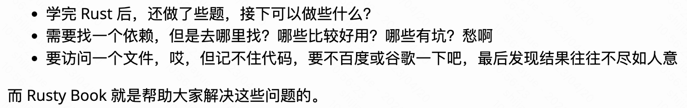

# wasmedge-resources

wasmedge学习过程中的一些资料的分享，以及遇到的问题和相应的解决方案

## 以下是一些常用网站的地址😄：

### Rust 
- Rust 程序设计语言

  中文版：https://kaisery.github.io/trpl-zh-cn/

  英文版：https://doc.rust-lang.org/stable/book/

- Rust语言圣经(Rust Course)
  
  https://course.rs/about-book.html

- Rust语言实战（Rust Course搭配）
  
  https://zh.practice.rs/why-exercise.html

- Rust by Example
  
  https://rustwiki.org/en/rust-by-example/index.html

- 锈书（Rusty Book）
  
  
  
  https://rusty.course.rs/about.html

- Rust标准库
  
  中文版：https://rustwiki.org/zh-CN/std/
  
  英文版：https://doc.rust-lang.org/std/index.html

- lib.rs（用来找包，搜索功能强大）
    
  https://lib.rs/

- crates仓库（用来下载包）
  
  https://crates.io/

- 贴代码和在线运行的平台
  
  https://play.rust-lang.org/?version=stable&mode=debug&edition=2021

### WASM 

- WASM官方文档

  中文版: http://webassembly.org.cn/

  英文版: https://webassembly.org/

- WebAssembly Spec

  https://github.com/WebAssembly/spec

  

### WASI 

- WASI文档
  
  https://wasi.dev/

- WASI需要实现的接口文档
  
  https://github.com/WebAssembly/WASI/blob/main/legacy/preview1/docs.md

### WasmEdgeRuntime 

- Second State 官网

  https://www.secondstate.io/

- Github仓库
  
  https://github.com/WasmEdge/WasmEdge

- 使用文档

  https://wasmedge.org/book/en/index.html

- WasmEdge-Rustsdk的使用例子
  
  https://github.com/second-state/wasmedge-rustsdk-examples

- WasmEdge中WASI的Cpp实现（可以作为参考）
  
  https://github.com/WasmEdge/WasmEdge/tree/master/lib/host/wasi

- WasmEdge中WASI的Rust参考实现
  
  https://github.com/apepkuss/WasmEdge/blob/rust/feat-new-vm/bindings/rust/wasmedge-sys/src/instance/custom_wasi_module.rs