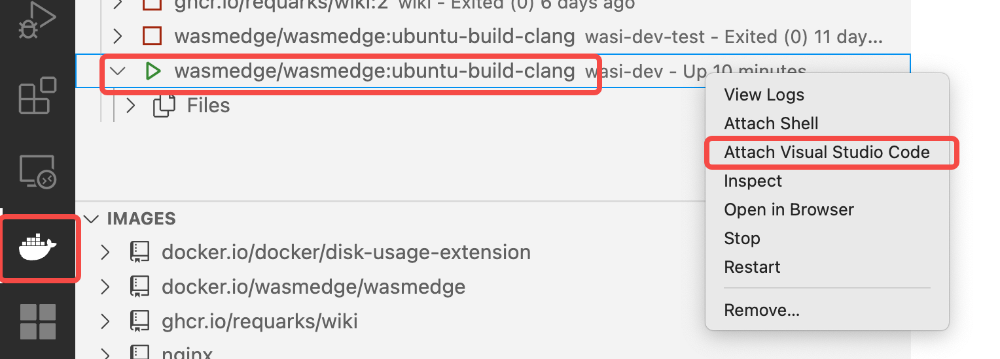
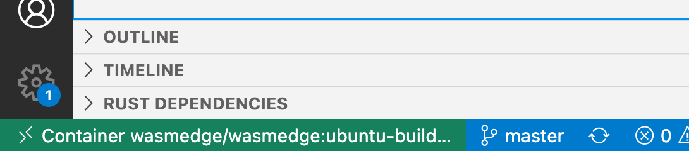
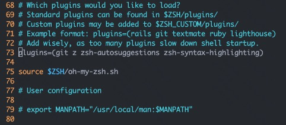

1. 在主机上新建一个文件夹, 用于和容器共享, 设为 /Users/bytedance/dev/wasm

2. 通过官网安装docker, 启动docker.app, 下载镜像wasmedge/wasmedge:ubuntu-build-clang
   ```shell
   docker pull wasmedge/wasmedge:ubuntu-build-clang
   ```

3. 使用命令 `docker run -it --name wasi-dev --mount type=bind,source=/Users/bytedance/dev/wasm,target=/root/wasm/ wasmedge/wasmedge:ubuntu-build-clang` 启动一个容器. 执行完命令后, 就在容器中开了一个 bash. 容器中的 `/root/wasm/` 就是我们的共享目录.(source目录需要提前创建)

4. 打开VSCode, 安装**Docker、Dev Containers、Remote-SSH**扩展,然后如图操作
   
   

5. 此时会打开一个新的VSCode窗口, 左下角会显示你在容器里, 然后打开文件夹即可开始工作.
   
   

6. 如果想切换文件夹, 该如何操作? 使用 Command + Shift + P 调出命令栏, 输入 File: Open Folder 即可.

本次开发完后, 容器怎么处理?

默认情况下, docker 不会把容器删除, 除非新建容器时指定了某些参数. 当退出容器时, 容器的状态会变成 Exited.

使用 `docker container list -a` 查看所有容器, 会发现自己上次用的容器还在.

先用 `docker start wasi-dev`启动容器

然后用 `docker exec -it wasi-dev /bin/bash` 启动, 其中 wasi-dev 是容器的名字.

<hr>

# docker ubuntu容器配置
- 更新apt安装包
   ```shell
   apt update
   apt upgrade
   ```
- 安装 rust 相关工具
   
   直接去[rust官网](https://www.rust-lang.org/tools/install)下

   ```shell
   curl --proto '=https' --tlsv1.2 -sSf https://sh.rustup.rs | sh
   ```
- 安装 wasmedge 相关工具链
   ```shell
   curl -sSf https://raw.githubusercontent.com/WasmEdge/WasmEdge/master/utils/install.sh | bash
   # 更新当前shell的环境变量
   source /root/.bashrc
   # 添加rustup toolchain
   rustup target add wasm32-wasi
   ```

- 安装 vim
   ```shell
   apt install vim
   ```

- git 配置 ssh
   ```shell
   # 生成秘钥对 (输入命令之后三次 enter )
   ssh-keygen -t ed25519 -C "your_email@example.com"
   # 在后台启动 ssh 代理
   eval "$(ssh-agent -s)"
   # 将私钥添加到ssh-agent代理
   ssh-add ~/.ssh/id_ed25519
   # 获取公钥
   cat ~/.ssh/id_ed25519.pub 
   ```

   将公钥加入github的ssh key中即可

- 安装 oh-my-zsh
   ```shell
   apt install zsh
   sh -c "$(curl -fsSL https://raw.github.com/robbyrussell/oh-my-zsh/master/tools/install.sh)"
   ```
   只用就可以用zsh了
   前面装 wasmedge 的时候 ~/.bashrc 中写入了一些环境变量的配置，要把它写到 ~/.zshrc中

   ```shell
   vim ~/.zshrc
   ```
   在最后写入：
   ```shell
   . "$HOME/.cargo/env"
   . "/root/.wasmedge/env"
   ```

   可以安装一些zsh的插件:
   - zsh-syntax-highlighting(command高亮，可以看到自己的命令是否正确)
      ```shell
      git clone https://github.com/zsh-users/zsh-syntax-highlighting.git ${ZSH_CUSTOM:-~/.oh-my-zsh/custom}/plugins/zsh-syntax-highlighting
      ```
   - zsh-autosuggestions(根据之前的命令自动补全)
      ```shell
      git clone https://github.com/zsh-users/zsh-autosuggestions ${ZSH_CUSTOM:-~/.oh-my-zsh/custom}/plugins/zsh-autosuggestions
      ```
   
   所有插件（包括下载的插件和默认自带的插件）都需要在 ~/.zshrc 中配置，如下图所示：
   
   

   第一次配置好需要执行`source ~/.zshrc`更新一下

   然后就可以愉快的干活了！！！！！

   之后就可以通过 `docker exec -it wasi-dev zsh` 进容器了

Ref

1. https://yeasy.gitbook.io/docker_practice/, 介绍了Docker常用的命令
2. https://zhuanlan.zhihu.com/p/61447507 oh-my-zsh 插件
