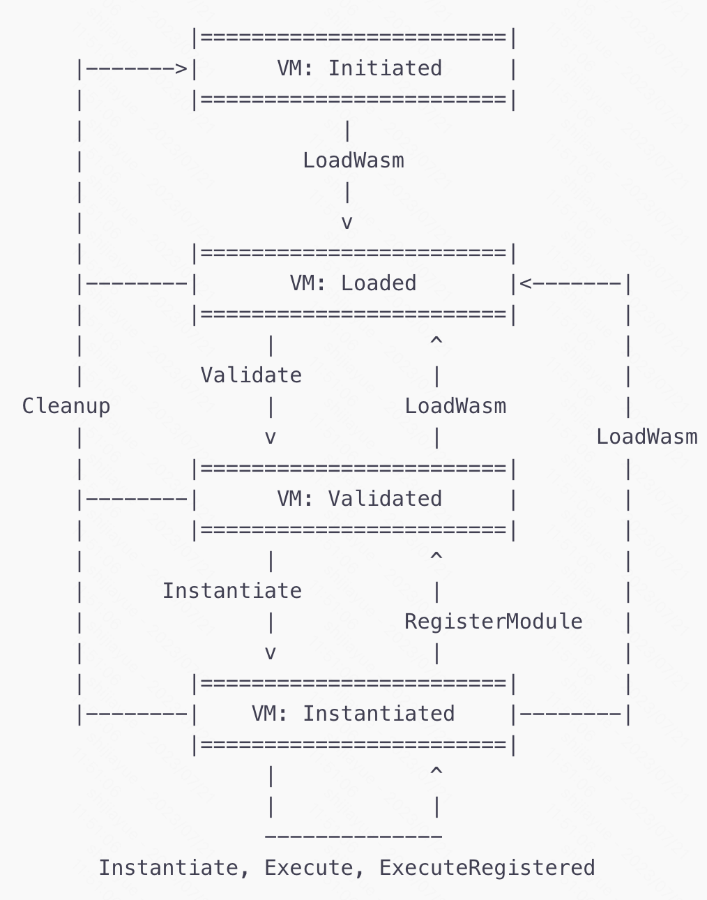

# WASMEDGE C API

[TOC]

wasmedge c 的 api 概览，对照着[官方文档](https://wasmedge.org/docs/embed/c/reference/latest#version)看吧

## Part 1 WasmEdge Basics [🔗](https://wasmedge.org/docs/embed/c/reference/latest/#wasmedge-basics)

### Version

提供了获取 **wasmedge 共享库版本**的一系列接口。

### Logging Settings

提供了**设置日志级别**或者**禁止日志**的一系列接口。

### Value Types

在 WasmEdge 中，开发者要通过 API 把所有的 values 转换成 `WasmEdge_Value` 对象再进行使用。

提供了一系列的**类型转换**接口，主要是将 C 中的类型和 `WasmEdge_Value` 类型相互转换。

包括数值类型和引用类型的类型转换，数值类型包括 `i32`, `i64`, `f32`, `f64`, `v128`。

引用类型包括方法引用 `funcref`，外部引用 `externref`。

还有判断引用是否为空等接口。

### Strings

提供了 C 的字符串转换和 `WasmEdge_String` 之间转换的一系列接口。
还有字符串比较的接口。

### Results

`WasmEdge_Result` 对象表示执行的结果。
提供一系列接口，包括判断结果是否成功，结果的 **code** 和 **message**等信息。

### Contexts

提供了创建包括 `VM`, `Store`, `Function` 在内的一系列对象的接口。

### WASM Data Structures

`Limit`: 用于 `Memory`、`Table` 等的创建，指定容量，结构如下:

```c
typedef struct WasmEdge_Limit {
  /// Boolean to describe has max value or not.
  bool HasMax;
  /// Boolean to describe is shared memory or not.
  bool Shared;
  /// Minimum value.
  uint32_t Min;
  /// Maximum value. Will be ignored if the `HasMax` is false.
  uint32_t Max;
} WasmEdge_Limit;
```

`Function type context`: 用于创建 WasmEdge 中的 `Function`、获取方法的信息等功能，包含入参出参类型。

`Table type context`: 用于创建 WasmEdge 中的 `Table`，由 `WasmEdge_RefType` 和 `WasmEdge_Limit` 构造。

`Memory type context`: 用于构造 WasmEdge 中的 `Memory`，指定 `WasmEdge_Limit` 构造。

`Global type context`: 用于构造 WasmEdge 中的 `Global`。

`Import type context`: 用于获取 `AST Module` 中的导入信息。

`Export type context`: 用于获取 `AST Module` 中的导出信息。

### Async

异步操作的一些接口

### Configurations

`WasmEdge_ConfigureContext` 管理了 `Loader`, `Validator`, `Executor`, `VM` 和 `Compiler` 的配置。

配置包括:

`Proposals`: 可以开启或者关闭 WebAssembly proposals。

`Host registrations`: 仅用于 `VM`，是否开启 `WASI` 支持。

`Maximum memory pages`: 用于 `Exector` 和 `VM`，管理内存页大小。

`Forcibly interpreter mode`: 执行 `.wasm` 的时候强制开启解释模式。

`AOT compiler options`: 配置 AOT 的优化等级，以及编译结果的形式。

`Statistics options`: 作用于 `Compiler`, `VM` 和 `Executor`，作用todo。

### Statistics

`WasmEdge_StatisticsContext` 提供了一系列的运行时数据统计，包括指令计数器、耗时统计。

## Part 2 WasmEdge VM [🔗](https://wasmedge.org/docs/embed/c/reference/latest/#wasmedge-vm)

主要介绍 `WasmEdge_VMContext` 对象，VM 用来加载注册 `wasm module`，并调用各种 `function`。

### VM 如何加载 wasm 文件并调用对应的方法 [🔗](https://wasmedge.org/docs/embed/c/reference/latest/#wasm-execution-example-with-vm-context)

下面是 VM 加载 wasm 文件并执行相应方法的整个步骤流。



1. Initiate: 初始化 VM
2. Load: 加载 wasm 文件到 VM 中
3. Validate: 验证加载的 wasm module
4. Instantiate: 实例化 wasm module
5. Execute: 执行 wasm function

### VM Creations [🔗](https://wasmedge.org/docs/embed/c/reference/latest/#vm-creations)

VM 的构建需要传入 `WasmEdge_ConfigureContext` 和 `WasmEdge_StoreContext`，如果用默认的配置，就传空即可。

### Built-in Host Modules and Plug-in Preregistrations [🔗](https://wasmedge.org/docs/embed/c/reference/latest/#built-in-host-modules-and-plug-in-preregistrations)

WasmEdge 提供了以下的内置 `host modules` 和 `plug-in`

1. Wasi

   可以在配置中打开 WASI 支持  
   也可以创建 WASI 的 module instance
2. plug-ins

   默认路径下有若干插件可供使用(首先需要下载 WasmEdge plug-ins)  
   使用插件之前需要先**加载**插件

`VM Context`会在创建的时候自动创建和注册已经加载的插件模块

### Host Module Registrations [🔗](https://wasmedge.org/docs/embed/c/reference/latest/#host-module-registrations)

`Host Funciton` 是 wasm 外部的方法，通过导入到 `wasm module` 使用。在 WasmEdge 中， `Host Function` 组合进 `Host Module` 当中，作为一个 `WasmEdge_ModuleInstanceContext` 对象，并拥有一个模块名，注册到 VM 中使用。

### WASM Registrations And Executions [🔗](https://wasmedge.org/docs/embed/c/reference/latest/#wasm-registrations-and-executions)

在 WebAssembly 中，`wasm module` 中的 instance 可以被导出或者被其他 wasm 模块导入。WasmEdge VM 提供了一系列的 API 来注册和导出 `wasm module`，并且可以执行注册了的 `wasm module` 的 `host function` 或者 `function`(function 是在 wasm module 中的，host function 是在 host module 中的)。

### Asynchronous Execution [🔗](https://wasmedge.org/docs/embed/c/reference/latest/#asynchronous-execution)

提供了异步执行的方法

### Instance Tracing [🔗](https://wasmedge.org/docs/embed/c/reference/latest/#instance-tracing)

用于获取 VM 中的实例

1. Store

   可以给 `VM` 初始化一个 `Store`，如果没有的话，`VM` 会自动分配一个 `Store`
   提供了获取 `Store` 的接口
2. List exported functions

   提供了接口来获取**方法名**以及**方法参数**列表
3. Get function types

   提供了接口来获取方法类型
4. Get the active module

   当 wasm 模块初始化之后，`VM` 会实例化一个 `anonymous module instance`
   提供了接口来获取 `anonymous module instance`
5. List and get the registered modules

   提供了接口来获取以及注册的 `module instance`
6. Get the components

   获取 `VM` 中的组件，包括 `Loader`, `Validator` 和 `Executor`。

## Part 3 WasmEdge Runtime [🔗](https://wasmedge.org/docs/embed/c/reference/latest/#wasmedge-runtime)

### Loader [🔗](https://wasmedge.org/docs/embed/c/reference/latest/#loader)

用于加载 wasm 的二进制文件或者加载 wasm 的二进制 buffer。  
支持 wasm 和 经过 wasmedge AOT 编译后的 wasm-aot  
加载后返回一个 `AST module context`

### Validator [🔗](https://wasmedge.org/docs/embed/c/reference/latest/#validator)

用于**验证** `wasm module`，`wasm module` 在实例化之前必须要经过验证。

### Exector [🔗](https://wasmedge.org/docs/embed/c/reference/latest/#executor)

执行器，必须要基于 `Store` 才能工作。

1. Instantiate and register an AST module as a named Module instance

    需要把 `AST module` 实例化到一个**命名**的 `module instance` 中，并注册到 `Store` 中。注册完之后，作为结果的 `Module instance` 由 `Store` 导出，并拥有相应的名称(上述命名 `module instance` 中的名称)。其他模块实例化时可以链接过去。

    `Store` 只是作为一个链接器，在实例化的时候将导出的 module 进行链接。当一个 `module instance` 被删除之后，这个 `module instance` 会自动和所有的 `Store` 断开链接。
2. Register an existing Module instance and export the module name

    可以把一个已经存在的 `module instance` 注册到 `Store` 中，并导出其模块名。一般用于 `host function`。
3. Instantiate an AST module to an anonymous Module instance

    把 `AST module` 实例化到匿名的 `module instance`
4. Invoke functions

    在注册或者实例化之后，可以调用 `module instance` 中导出的方法
5. Asynchronously invoke functions

    同上，但是异步调用

### AST Module [🔗](https://wasmedge.org/docs/embed/c/reference/latest/#ast-module)

将 wasm 的二进制通过 `Loader` 加载后得到 `AST Module`，表示为一种 **loaded structure**。在实例化之前，可以获取 `AST Module` 中的导入实例和导出实例。

### Store [🔗](https://wasmedge.org/docs/embed/c/reference/latest/#store)

用来表示 wasm 程序可以操作的所有 `global state` 的一种运行时结构。在实例化的时候链接模块，当 `Store` 被删除之后，所有其中的模块都会和 `Store` 断开链接；一个 `Module instance` 删除后，会和所有以及链接的 `Store` 断开链接。

### Instance [🔗](https://wasmedge.org/docs/embed/c/reference/latest/#instances)

1. Module Instance
2. Function instance
3. Table Instance
4. Memory Instance
5. Global Instance

### Host Functions [🔗](https://wasmedge.org/docs/embed/c/reference/latest/#host-functions)

C 中 `Host Function` 的声明如下

1. Host function allocation

    ```c
    typedef WasmEdge_Result (*WasmEdge_HostFunc_t)(
        void *Data, const WasmEdge_CallingFrameContext *CallFrameCxt,
        const WasmEdge_Value *Params, WasmEdge_Value *Returns);
    ```

    e.g. 定义 add 方法

    ```c
    WasmEdge_Result Add(void *, const WasmEdge_CallingFrameContext *,
                        const WasmEdge_Value *In, WasmEdge_Value *Out) {
        /*
        * Params: {i32, i32}
        * Returns: {i32}
        * Developers should take care about the function type.
        */
        /* Retrieve the value 1. */
        int32_t Val1 = WasmEdge_ValueGetI32(In[0]);
        /* Retrieve the value 2. */
        int32_t Val2 = WasmEdge_ValueGetI32(In[1]);
        /* Output value 1 is Val1 + Val2. */
        Out[0] = WasmEdge_ValueGenI32(Val1 + Val2);
        /* Return the status of success. */
        return WasmEdge_Result_Success;
    }
    ```

    构建 `Host Function`

    ```c
    enum WasmEdge_ValType ParamList[2] = {WasmEdge_ValType_I32,
                                          WasmEdge_ValType_I32};
    enum WasmEdge_ValType ReturnList[1] = {WasmEdge_ValType_I32};
    /* Create a function type: {i32, i32} -> {i32}. */
    WasmEdge_FunctionTypeContext *HostFType =
        WasmEdge_FunctionTypeCreate(ParamList, 2, ReturnList, 1);
    /*
    * Create a function context with the function type and host function body.
    * The `Cost` parameter can be 0 if developers do not need the cost
    * measuring.
    */
    WasmEdge_FunctionInstanceContext *HostFunc =
        WasmEdge_FunctionInstanceCreate(HostFType, Add, NULL, 0);
    /*
    * The third parameter is the pointer to the additional data.
    * Developers should guarantee the life cycle of the data, and it can be
    * `NULL` if the external data is not needed.
    */
    WasmEdge_FunctionTypeDelete(HostType);

    /*
    * If the function instance is __NOT__ added into a module instance context,
    * it should be deleted.
    */
    WasmEdge_FunctionInstanceDelete(HostFunc);
    ```

2. Calling frame context

   `WasmEdge_CallingFrameContext` 可以用于获取 `calling stack` 顶部栈帧中的 `module instance`。根据 wasm spec，当调用了一个方法之后，对应的 `module instance` 会被放入栈顶。因此，`host function` 可以通过 `WasmEdge_CallingFrameGetMemoryInstance()` 方法从栈顶获取 `module instance` 中的 `memory instance`从而来读写数据。也可以通过 `WasmEdge_CallingFrameGetModuleInstance()` 直接来获取 `module instance`。同样可以使用 `WasmEdge_CallingFrameGetExecutor()` 来获取当前的 `Exector`。

3. User-defined error code of the host functions
4. Construct a module instance with host instances

   创建一个 `Host Module` 的 `Module Instance`，包含了 `Host Function`
5. Specified module instance

   `WasmEdge_ModuleInstanceCreateWASI()` 方法可以创建 `WASI module instance`

### Plug-ins [🔗](https://wasmedge.org/docs/embed/c/reference/latest/#plug-ins)

WasmEdge 的 `plug-ins` 是一些共享库，提供给 WasmEdge runtime 来加载和创建 `host module instance`用的。WasmEdge runtime 可以通过插件更方便地扩展。

1. Load plug-ins from paths

   要使用插件，首先要从指定路径**加载插件**。  
   使用 `WasmEdge_PluginLoadWithDefaultPaths()` 接口，调用之后在默认路径下的插件会被加载。默认路径如下：
    1. 环境变量 `WASMEDGE_PLUGIN_PATH` 设置的路径
    2. `<WasmEdge installation path>/../plugin/` 下的插件
    3. 如果 WasmEdge 下载在了系统文件夹下，`library path` 下的 `./wasmedge/` 中的插件也会被加载

    也可以加载指定路径下的插件，使用 `WasmEdge_PluginLoadFromPath("PATH_TO_PLUGIN/plugin.so")` 接口即可。
2. Get the plug-in by name

   可以通过 `WasmEdge_PluginListPlugins` 接口列出所有加载的插件名称  
   也可以通过 `WasmEdge_PluginFind(NameString)` 来获取指定的 `WasmEdge_PluginContext`。
3. Create the module instance from a plug-in

    使用接口 `WasmEdge_PluginCreateModule` 可以通过 `WasmEdge_PluginContext` 创建对应的 `module instance`。
