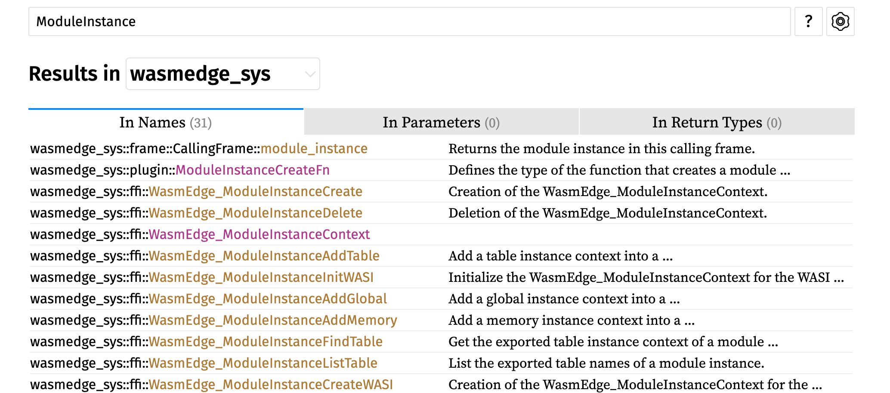

## Cargo.toml

wasmedge-sdk 的仓库已经从 WasmEdge/WasmEdge 迁移到 WasmEdge/wasmedge-rust-sdk

依赖写法如下. 其中 features 的指定, 可以去对应仓库根目录下的 Cargo.toml 文件找. standalone 意味着不需要提前安装 C API.

```toml
[dependencies]
# wasmedge-sdk = {git = "https://github.com/WasmEdge/wasmedge-rust-sdk", branch = "main", features = ["ffi", "standalone"]}

```

```toml
# wasmedge-rust-sdk/Cargo.toml
# This crate depends on the WasmEdge C API. In linux/macOS the crate can download the API at build time by enabling the `standalone` feature.
[features]
aot = ["wasmedge-sys/aot"]
async = ["wasmedge-sys/async", "dep:async-wasi"]
default = []
ffi = ["wasmedge-sys/ffi"]
standalone = ["wasmedge-sys/standalone"]
static = ["wasmedge-sys/static"]
wasi_crypto = ["wasmedge-sys/wasi_crypto"]
wasi_nn = ["wasmedge-sys/wasi_nn"]
wasmedge_process = ["wasmedge-sys/wasmedge_process"]
```

## PluginDescriptor & ModuleDescriptor

各种 crate 看晕了, 除了 README 中包括的 sdk, lib, sys, types 之外. 还有民间的 wasmedge_plugin_sdk, wasmedge-bindgen, wasmedge-sdk-bindgen

而且, 没找到一个官方的, 用 Rust 开发的插件. 从 WasmEdge 的代码来看, 所有插件都用 CPP 实现了. 

皆靠 ffi, 原因是有些结构体根本不存在, 就比如 [PluginModule](https://wasmedge.github.io/wasmedge-rust-sdk/wasmedge_sdk/plugin/struct.PluginModule.html) 里不存在 ModuleDescription.

ffi 其实是 wasmedge-sys 的一个模块, 看起来我们应该用 wasmedge-sys 开发.

> For developers, it is strongly recommended that the APIs in `wasmedge-sys` are used to construct high-level libraries, while `wasmedge-sdk` is for building up business applications.

ffi 开发的问题在于, 接口的函数原型变了, 而且很多类型其实不存在了, 有些类型变成了其他类型.

```
wasmedge_sys::plugin::{PluginDescriptor, ModuleDescriptor, PluginVersion};
```

## Module Instance

SDK 中没有 Module Instance, ffi 过来的结构体只相当于一个类型, 没有方法. 对于一个实体, 可能需要调用多个相关的函数才能完成相应操作, 比如 Module Instance.



盲猜 ModuleInstance 对应 ModuleInstanceContext

然而 ModuleInstanceCreate 方法仅接受一个 Name 参数, 很显然不对.

custom_wasi_module 的实现方式 (暂时还没看懂, rust 几乎忘完了), 而且没发现元信息在什么地方.

simple plugin 给出的方法比较清楚, 直接用 **ImportObjectBuilder**, 然而该结构体是 sdk 的, sys 里没有...

## Rust 插件 "规范"

kiko 在 debugging-v3 中已经将插件从系统库中加载的过程说的很明确了, 最关键的地方如下

```cpp
// GetDescriptor 是一个函数指针, 用于返回 WasmEdge_PluginDescriptor * 
// decltype 关键字用于获取表达式的类型
if (auto GetDescriptor = Lib->get<decltype(WasmEdge_Plugin_GetDescriptor)>(
        "WasmEdge_Plugin_GetDescriptor");
    unlikely(!GetDescriptor)) {
  return false;
} else if (const auto *Descriptor = GetDescriptor();
           unlikely(!Descriptor)) {
  return false;
} else {
  CAPIPluginRegisters.push_back(
      std::make_unique<CAPIPluginRegister>(Descriptor));
}

// WasmEdge_Plugin_GetDescriptor 是一个函数, 定义在 include/api/wasmedge/wasmedge.h 中
// 其中, WASMEDGE_CAPI_PLUGIN_EXPORT 是一个编译宏, WasmEdge_PluginDescriptor 是一个结构体类型
/// Implement by plugins for returning the plugin descriptor.
/// \returns the plugin descriptor.
WASMEDGE_CAPI_PLUGIN_EXPORT extern const WasmEdge_PluginDescriptor *
WasmEdge_Plugin_GetDescriptor(void);
```

WasmEdge_PluginDescriptor 之前 kiko 已经说过了, 包括了插件所有的必要信息

再回过头来看 simple-plugin, 就发现其为什么这样写了, **规范其实就是 WasmEdge_PluginDescriptor 结构体**

```rust
/// Defines PluginDescriptor
#[export_name = "WasmEdge_Plugin_GetDescriptor"]
pub extern "C" fn plugin_hook() -> *const ffi::WasmEdge_PluginDescriptor {
    let name = "naive_math_plugin";
    let desc = "this is naive math plugin";
    let version = PluginVersion::new(0, 0, 0, 0);
    let plugin_descriptor = PluginDescriptor::new(name, desc, version)
        .expect("Failed to create plugin descriptor")
        .add_module_descriptor(
            "naive_math_module",
            "this is naive math module",
            Some(create_test_module),
        )
        .expect("Failed to add module descriptor");

    let boxed_plugin = Box::new(plugin_descriptor);
    let plugin = Box::leak(boxed_plugin);

    plugin.as_raw_ptr()
}

```

关于上述代码的一些解释:

1.  `#[export_name = "WasmEdge_Plugin_GetDescriptor"]` 指定了外部代码应该如何引用 `plugin_hook` 函数. 更通俗的说, 该函数在生成的共享库中的名称应该是 `WasmEdge_Plugin_GetDescriptor`

2. pub 表示该函数是公开的, 其他模块和 crate 可以访问

3. `extern "C"` 有两个作用

   + **维护C ABI 兼容性**:

     默认情况下，Rust 使用它自己的函数调用约定和名称修饰规则，当我们想要从 C 或其他语言调用 Rust 函数，我们需要确保使用的是正确的应用程序二进制接口 (ABI)。`extern "C"` 指示 Rust 使用 C ABI，这使得函数可以在不同的编程语言之间互操作

   + **名称修饰**:

     不同的编程语言和编译器有各自的方法来修饰或更改函数和变量的名称，这称为名称修饰 (name mangling)。例如，C++ 为了支持函数重载，会对函数名称进行修饰以区分不同的函数版本。Rust 也对其函数名称进行修饰，以支持其特性，如泛型。

     当使用 `extern "C"` 时，Rust 会禁用名称修饰，保持函数名不变，从而使其可以从 C 或其他语言轻松调用

   > # Keyword [extern](https://doc.rust-lang.org/std/keyword.extern.html#) 
   >
   > Link to or import external code.
   >
   > The `extern` keyword is used in two places in Rust. One is in conjunction with the [`crate`](https://doc.rust-lang.org/std/keyword.crate.html) keyword to make your Rust code aware of other Rust crates in your project, i.e., `extern crate lazy_static;`. The other use is in foreign function interfaces (FFI).
   >
   > `extern` is used in two different contexts within FFI. The first is in the form of external blocks, for declaring function interfaces that Rust code can call foreign code by.
   >
   > ```rust
   > # 声明外部函数
   > #[link(name = "my_c_library")]
   > extern "C" {
   >     fn my_c_function(x: i32) -> bool;
   > }
   > ```
   >
   > This code would attempt to link with `libmy_c_library.so` on unix-like systems and `my_c_library.dll` on Windows at runtime, and panic if it can’t find something to link to. Rust code could then use `my_c_function` as if it were any other unsafe Rust function. Working with non-Rust languages and FFI is inherently unsafe, so wrappers are usually built around C APIs.
   >
   > The mirror use case of FFI is also done via the `extern` keyword:
   >
   > ```rust
   > # 从其他语言调用 rust 函数
   > #[no_mangle]
   > pub extern "C" fn callable_from_c(x: i32) -> bool {
   >     x % 3 == 0
   > }
   > ```
   >
   > If compiled as a dylib, the resulting .so could then be linked to from a C library, and the function could be used as if it was from any other library.
   >
   > For more information on FFI, check the [Rust book](https://doc.rust-lang.org/book/ch19-01-unsafe-rust.html#using-extern-functions-to-call-external-code) or the [Reference](https://doc.rust-lang.org/reference/items/external-blocks.html).

4. PluginDescriptor 定义在 wasmedge-sys/src/plugin.rs 中, as_raw_ptr 作为其方法, 返回规范的指针

   ```rust
   /// Returns the raw pointer to the inner `WasmEdge_PluginDescriptor`.
   #[cfg(feature = "ffi")]
   pub fn as_raw_ptr(&self) -> *const ffi::WasmEdge_PluginDescriptor {
       &self.inner
   }
   ```

   ffi 是 wasmedge-sys 的一个模块, WasmEdge_PluginDescriptor 是该模块中的一个结构体

   ffi 是使用 rust-bindgen 生成的, 所以 WasmEdge_PluginDescriptor 应该有明确的定义, 其定义就在 `simple-plugin/target/debug/build/wasmedge-sys-a230aa7755b675e1/out/wasmedge.rs` 中, 从路径来看是编译的时候动态生成的

   ```rust
   // out/wasmedge.rs
   // [repr(C)] 表示结构体使用C的内存结构
   /* automatically generated by rust-bindgen 0.61.0 */
   #[doc = " Plugin descriptor for plugins."]
   #[repr(C)]
   #[derive(Debug, Copy, Clone)]
   pub struct WasmEdge_PluginDescriptor {
       pub Name: *const ::std::os::raw::c_char,
       pub Description: *const ::std::os::raw::c_char,
       pub APIVersion: u32,
       pub Version: WasmEdge_PluginVersionData,
       pub ModuleCount: u32,
       pub ProgramOptionCount: u32,
       pub ModuleDescriptions: *mut WasmEdge_ModuleDescriptor,
       pub ProgramOptions: *mut WasmEdge_ProgramOption,
   }
   
   #[doc = " Module descriptor for plugins."]
   #[repr(C)]
   #[derive(Debug, Copy, Clone)]
   pub struct WasmEdge_ModuleDescriptor {
       pub Name: *const ::std::os::raw::c_char,
       pub Description: *const ::std::os::raw::c_char,
       pub Create: ::std::option::Option<
           unsafe extern "C" fn(
               arg1: *const WasmEdge_ModuleDescriptor,
           ) -> *mut WasmEdge_ModuleInstanceContext,
       >,
   }
   
   #[repr(C)]
   #[derive(Debug, Copy, Clone)]
   pub struct WasmEdge_ModuleInstanceContext {
       _unused: [u8; 0],			// 大小为0的u8类型数组, 该结构体仅仅用做类型
   }
   
   extern "C" {
       #[doc = " Create the module instance in the plug-in by the module name."]
       #[doc = ""]
       #[doc = " By giving the module name, developers can retrieve the module in the plug-in"]
       #[doc = " and create the module instance."]
       #[doc = " The caller owns the object and should call `WasmEdge_ModuleInstanceDelete`"]
       #[doc = " to destroy it."]
       #[doc = ""]
       #[doc = " \\param Cxt the WasmEdge_PluginContext to retrieve and create module."]
       #[doc = " \\param ModuleName the module name to retrieve."]
       #[doc = ""]
       #[doc = " \\returns pointer to the module instance context, NULL if the module name not"]
       #[doc = " found in the plug-in or the plug-in is not valid."]
       pub fn WasmEdge_PluginCreateModule(		// 用于新建 WasmEdge_ModuleInstanceContext 类型的函数
           Cxt: *const WasmEdge_PluginContext,
           ModuleName: WasmEdge_String,
       ) -> *mut WasmEdge_ModuleInstanceContext;
   }
   ```

   WasmEdge_ModuleInstanceContext 只是一个空结构体, 不占用任何空间. 只使用其指针来标识一个 ModuleInstance 结构. 正因为其是空结构体, 所以我们没办法直接使用其指针指向的结构. 因此, ffi 提供了一系列函数, 用于建立和操作 ModuleInstance. 这样的好处是封装性, 可以在不影响其他代码的情况下更改数据结构的内部实现. 缺点是用起来麻烦, 接口有严格限制.

## TODO

- 复习 rust, 先看懂 custom_wasi_module 里是如何定义一个 ModuleInstance 的

- ~~或者 了解规范是什么, 自定义实现一个~~

- ###### 如何使用 IDE 索引 ffi 中定义的结构体? (为了方便跳转代码, 也方便开发, 函数提示之类). 可以问下 Sam

